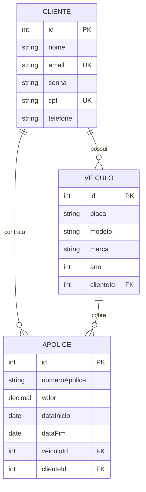
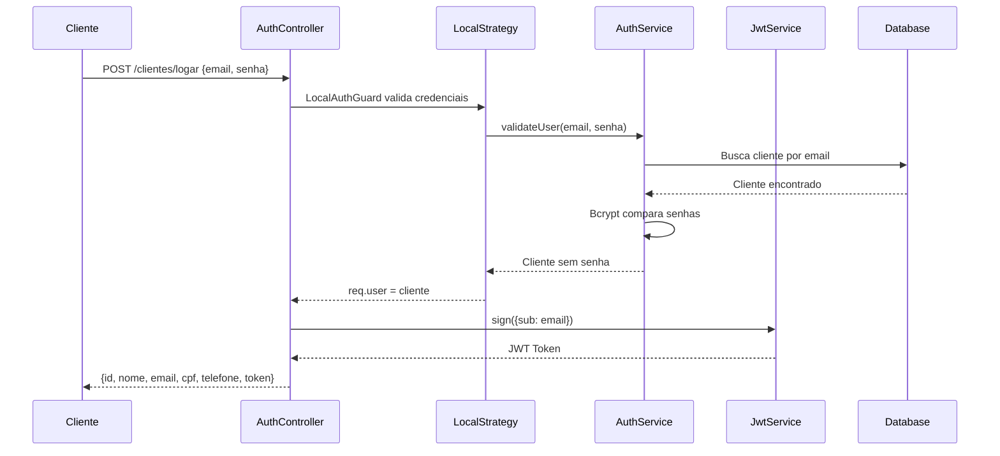

<p align="center">
  
</p>

<h1 align="center">🚗 Seguro de Carros - Backend API</h1>

<p align="center">
  API REST para sistema de gerenciamento de seguros de veículos desenvolvida com NestJS, TypeORM e autenticação JWT.
</p>

<p align="center">
  <a href="https://nestjs.com" target="_blank"></a>
  <a href="https://www.typescriptlang.org" target="_blank"></a>
  <a href="https://typeorm.io" target="_blank"></a>
  
</p>

---

## 👥 Equipe de Desenvolvimento

| Nome           | Função        |
| -------------- | ------------- |
| Aiyra Johann   | Developer     |
| Ana Silva      | Tester        |
| Andrey Rosa    | Developer     |
| Mamadou Diagne | Developer     |
| Marcos Rosa    | Product Owner |
| Nathália Lima  | Developer     |
| Nicolas Donada | Developer     |

---

## 📋 Índice

- [Sobre o Projeto](#sobre-o-projeto)
- [Diagrama de Entidades](#diagrama-de-entidades)
- [Arquitetura de Autenticação](#arquitetura-de-autenticação)
- [Tecnologias e Dependências](#tecnologias-e-dependências)
- [Estrutura do Projeto](#estrutura-do-projeto)
- [Instalação e Execução](#instalação-e-execução)
- [Documentação da API (Swagger)](#documentação-da-api-swagger)
- [Endpoints da API](#endpoints-da-api)

---

## 📖 Sobre o Projeto

Este projeto é uma API REST para gerenciamento de **seguros de veículos**, desenvolvido como parte do **Desafio 3 da Turma JavaScript 10** da Generation Brasil. O sistema permite:

- **Cadastro e autenticação de clientes** com JWT
- **Gerenciamento de veículos** vinculados aos clientes
- **Criação e gestão de apólices de seguro** com cálculo automático de desconto

### Regra de Negócio

O sistema aplica um **desconto de 20%** no valor da apólice para veículos com mais de **10 anos de idade**.

---

## 🗂️ Diagrama de Entidades



### Relacionamentos

| Entidade              | Relacionamento | Descrição                                       |
| --------------------- | -------------- | ----------------------------------------------- |
| `Cliente` → `Veiculo` | **1:N**        | Um cliente pode possuir vários veículos         |
| `Cliente` → `Apolice` | **1:N**        | Um cliente pode ter várias apólices             |
| `Veiculo` → `Apolice` | **1:N**        | Um veículo pode ser coberto por várias apólices |

---

## 🔐 Arquitetura de Autenticação

O sistema utiliza autenticação **JWT (JSON Web Token)** com a biblioteca **Passport.js**.



### Componentes de Autenticação

| Componente         | Arquivo                           | Descrição                                 |
| ------------------ | --------------------------------- | ----------------------------------------- |
| **LocalStrategy**  | `auth/strategy/local.strategy.ts` | Valida email/senha no login               |
| **JwtStrategy**    | `auth/strategy/jwt.strategy.ts`   | Valida tokens JWT nas requisições         |
| **LocalAuthGuard** | `auth/guard/local-auth.guard.ts`  | Guard para rota de login                  |
| **JwtAuthGuard**   | `auth/guard/jwt-auth.guard.ts`    | Guard para rotas protegidas               |
| **Bcrypt**         | `auth/bcrypt/bcrypt.ts`           | Criptografia de senhas (salt rounds: 10)  |
| **AuthService**    | `auth/services/auth.service.ts`   | Lógica de autenticação e geração de token |

### Fluxo de Autenticação

1. **Cadastro** (`POST /clientes/cadastrar`): Senha é criptografada com Bcrypt antes de salvar
2. **Login** (`POST /clientes/logar`): LocalStrategy valida credenciais e retorna JWT com expiração de **2 horas**
3. **Rotas Protegidas**: JwtAuthGuard extrai e valida o token do header `Authorization: Bearer <token>`

---

## 🛠️ Tecnologias e Dependências

### Dependências de Produção

| Pacote               | Versão  | Descrição                      |
| -------------------- | ------- | ------------------------------ |
| `@nestjs/common`     | ^11.0.1 | Módulos comuns do NestJS       |
| `@nestjs/core`       | ^11.0.1 | Core do framework NestJS       |
| `@nestjs/config`     | ^4.0.2  | Gerenciamento de configurações |
| `@nestjs/jwt`        | ^11.0.2 | Módulo JWT para autenticação   |
| `@nestjs/passport`   | ^11.0.5 | Integração com Passport.js     |
| `@nestjs/swagger`    | ^11.2.3 | Documentação OpenAPI/Swagger   |
| `@nestjs/typeorm`    | ^11.0.0 | Integração com TypeORM         |
| `bcrypt`             | ^6.0.0  | Criptografia de senhas         |
| `class-transformer`  | ^0.5.1  | Transformação de classes       |
| `class-validator`    | ^0.14.3 | Validação de DTOs              |
| `mysql2`             | ^3.16.0 | Driver MySQL                   |
| `pg`                 | ^8.16.3 | Driver PostgreSQL              |
| `passport`           | ^0.7.0  | Framework de autenticação      |
| `passport-jwt`       | ^4.0.1  | Estratégia JWT para Passport   |
| `passport-local`     | ^1.0.0  | Estratégia Local para Passport |
| `typeorm`            | ^0.3.28 | ORM para TypeScript            |
| `swagger-ui-express` | ^5.0.1  | UI do Swagger                  |

### Dependências de Desenvolvimento

| Pacote            | Versão  | Descrição                    |
| ----------------- | ------- | ---------------------------- |
| `@nestjs/cli`     | ^11.0.0 | CLI do NestJS                |
| `@nestjs/testing` | ^11.0.1 | Utilitários de teste         |
| `typescript`      | ^5.7.3  | Compilador TypeScript        |
| `jest`            | ^30.0.0 | Framework de testes          |
| `eslint`          | ^9.18.0 | Linter JavaScript/TypeScript |
| `prettier`        | ^3.4.2  | Formatador de código         |

---

## 📁 Estrutura do Projeto

```
src/
├── app.module.ts            # Módulo principal
├── app.controller.ts        # Controller raiz
├── app.service.ts           # Service raiz
├── main.ts                  # Bootstrap da aplicação
│
├── auth/                    # Módulo de Autenticação
│   ├── auth.module.ts
│   ├── bcrypt/
│   │   └── bcrypt.ts        # Serviço de criptografia
│   ├── constants/
│   │   └── constants.ts     # Chave secreta JWT
│   ├── controllers/
│   │   └── auth.controller.ts
│   ├── entities/
│   │   └── clientlogin.entity.ts
│   ├── guard/
│   │   ├── jwt-auth.guard.ts
│   │   └── local-auth.guard.ts
│   ├── interfaces/
│   │   ├── cliente-response.interface.ts
│   │   └── cliente-sem-senha.interface.ts
│   ├── services/
│   │   └── auth.service.ts
│   └── strategy/
│       ├── jwt.strategy.ts
│       └── local.strategy.ts
│
├── cliente/                 # Módulo Cliente
│   ├── cliente.module.ts
│   ├── controllers/
│   │   └── cliente.controller.ts
│   ├── entities/
│   │   └── cliente.entity.ts
│   └── services/
│       └── cliente.service.ts
│
├── veiculo/                 # Módulo Veículos
│   ├── veiculo.module.ts
│   ├── controllers/
│   │   └── veiculo.controller.ts
│   ├── entities/
│   │   └── veiculo.entity.ts
│   └── services/
│       └── veiculo.service.ts
│
├── apolice/                 # Módulo Apólices
│   ├── apolice.module.ts
│   ├── controllers/
│   │   └── apolice.controller.ts
│   ├── entities/
│   │   └── apolice.entity.ts
│   └── services/
│       └── apolice.service.ts
│
└── data/                    # Configurações de Banco
    └── services/
        ├── dev.service.ts   # MySQL (desenvolvimento)
        └── prod.service.ts  # PostgreSQL (produção)
```

---

## 🚀 Instalação e Execução

### Pré-requisitos

- **Node.js** v18 ou superior
- **npm** ou **yarn**
- **MySQL** (desenvolvimento) ou **PostgreSQL** (produção)

### 1. Clonar o Repositório

```bash
git clone https://github.com/Grupo-03-Turma-JavaScript-10/seguro-de-carros-backend.git
cd seguro-de-carros-backend
```

### 2. Instalar Dependências

```bash
npm install
```

### 3. Configurar Banco de Dados

#### Desenvolvimento (MySQL)

Crie o banco de dados MySQL:

```sql
CREATE DATABASE db_seguro_de_carros;
```

> **Nota:** As credenciais padrão são configuradas em `src/data/services/dev.service.ts`:
>
> - Host: `localhost`
> - Porta: `3306`
> - Usuário: `root`
> - Senha: `root`

#### Produção (PostgreSQL)

Configure a variável de ambiente `DATABASE_URL` com a connection string do PostgreSQL.

### 4. Executar a Aplicação

```bash
# Modo desenvolvimento (com hot-reload)
npm run start:dev

# Modo produção
npm run build
npm run start:prod
```

A aplicação estará disponível em: `http://localhost:4000`

### 5. Executar Testes

```bash
# Testes unitários
npm run test

# Testes e2e
npm run test:e2e

# Cobertura de testes
npm run test:cov
```

---

## 📚 Documentação da API (Swagger)

A documentação interativa da API está disponível através do **Swagger UI**:

🔗 **URL:** `http://localhost:4000/swagger`

### Recursos do Swagger

- **Visualização** de todos os endpoints disponíveis
- **Teste interativo** das requisições diretamente pelo navegador
- **Autenticação** via Bearer Token (botão "Authorize")
- **Schemas** das entidades com exemplos de payloads

### Como usar o Swagger com autenticação

1. Acesse `/swagger`
2. Execute `POST /clientes/cadastrar` para criar um cliente
3. Execute `POST /clientes/logar` com as credenciais
4. Copie o `token` retornado
5. Clique em "Authorize" no topo da página
6. Cole o token no formato: `Bearer <seu_token>`
7. Agora você pode acessar todas as rotas protegidas

---

## 🔌 Endpoints da API

### Autenticação (Públicos)

| Método | Endpoint              | Descrição                    |
| ------ | --------------------- | ---------------------------- |
| `POST` | `/clientes/cadastrar` | Cadastrar novo cliente       |
| `POST` | `/clientes/logar`     | Autenticar e obter token JWT |

### Cliente (Protegidos 🔒)

| Método   | Endpoint        | Descrição                |
| -------- | --------------- | ------------------------ |
| `GET`    | `/clientes/all` | Listar todos os clientes |
| `GET`    | `/clientes/:id` | Buscar cliente por ID    |
| `PUT`    | `/clientes/:id` | Atualizar cliente        |
| `DELETE` | `/clientes/:id` | Remover cliente          |

### Veículo (Protegidos 🔒)

| Método   | Endpoint        | Descrição                |
| -------- | --------------- | ------------------------ |
| `GET`    | `/veiculos`     | Listar todos os veículos |
| `GET`    | `/veiculos/:id` | Buscar veículo por ID    |
| `POST`   | `/veiculos`     | Cadastrar novo veículo   |
| `PUT`    | `/veiculos/:id` | Atualizar veículo        |
| `DELETE` | `/veiculos/:id` | Remover veículo          |

### Apólice (Protegidos 🔒)

| Método   | Endpoint       | Descrição                |
| -------- | -------------- | ------------------------ |
| `GET`    | `/apolice`     | Listar todas as apólices |
| `GET`    | `/apolice/:id` | Buscar apólice por ID    |
| `POST`   | `/apolice`     | Criar nova apólice       |
| `PUT`    | `/apolice/:id` | Atualizar apólice        |
| `DELETE` | `/apolice/:id` | Remover apólice          |

---

## 📄 Licença

Este projeto foi desenvolvido para fins educacionais como parte do bootcamp da **Generation Brasil**.

---

<p align="center">
  Desenvolvido com ❤️ pela <strong>Equipe 3 - Turma JavaScript 10</strong>
</p>
